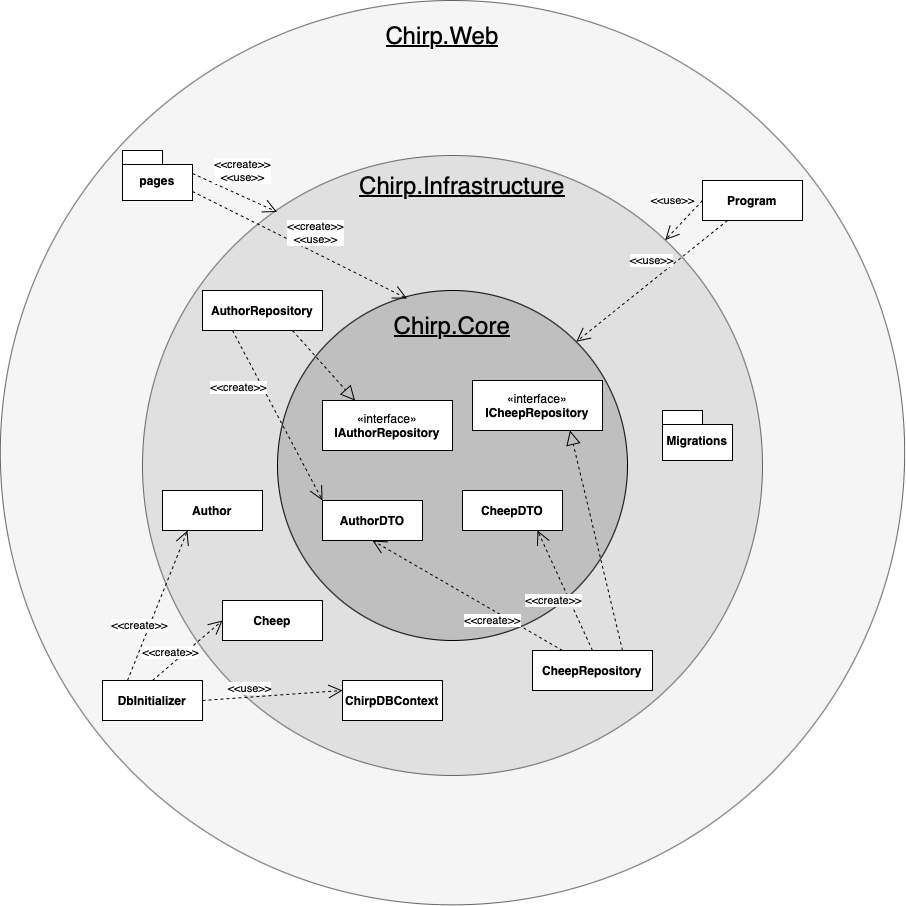
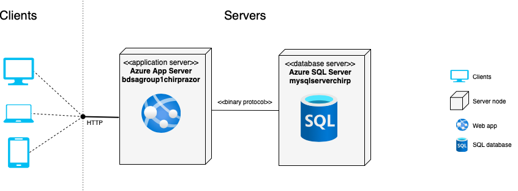

Vi skal huske det her: Store all sources of your diagrams, i.e., PlantUML diagram source code or DrawIO XML files under docs in a directory called diagrams.

# Design and Architecture of _Chirp!_

## Domain model

Here comes a description of our domain model.

## Architecture — In the small

Above is an illustration of the organization of our _Chirp!_ application. We use the architectural pattern called Onion Architecture to structure our code base. For each layer we illustrate the classes, interfaces, and packages that are part of the layer. The arrows illustrate the dependencies between the layers. For simplicity's sake, we have not illustrated the dependencies between the classes and interfaces within each layer. The illustration shows how dependencies flow inward and never outward, meaning that the inner layers have no knowledge of the outer layers. Our architecture consists of three layers, each represented by a different project/package(?) in our code base. The innermost layer Chirp.Core contains the data transfer objects (DTOs) and interfaces for the repositories. The middle layer Chirp.Infrastructure contains implementations of the repositories, the database context, and the domain model. It also contains the migrations for the database. The outermost layer Chirp.Web contains the startup class, the database initializer and views/pages(?).

## Architecture of deployed application

Above is a deployment diagram that illustrates the architecture of our deployed _Chirp!_ application. It is a client-server application that is deployed to Azure, where the web app and the SQL database are hosted on different servers. Their means of communication are also illustrated. A legend is provided to the right of the diagram.

## User activities

## Sequence of functionality/calls trough _Chirp!_

# Process

## Build, test, release, and deployment

## Team work

## How to make _Chirp!_ work locally

## How to run test suite locally

# Ethics

## License

## LLMs, ChatGPT, CoPilot, and others