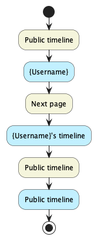

Vi skal huske det her: Store all sources of your diagrams, i.e., PlantUML diagram source code or DrawIO XML files under docs in a directory called diagrams.

# Design and Architecture of _Chirp!_

## Domain model

Above is a UML class diagram of the domain model for our _Chirp!_ application. Here you can see the fields the objects contain and how they associate with each other.

## Architecture — In the small

Above is an illustration of the organization of our _Chirp!_ application. We use the architectural pattern called Onion Architecture to structure our code base. For each layer represented by a different nuance of gray, we illustrate the classes, interfaces, and packages that are part of the layer. The arrows illustrate the dependencies between the layers. For simplicity's sake, we have not illustrated the dependencies between the classes and interfaces within each layer. The illustration shows how dependencies flow inward and never outward, meaning that the inner layers have no knowledge of the outer layers. Our architecture consists of three layers, each represented by a different project in our code base. 

## Architecture of deployed application

Above is a deployment diagram that illustrates the architecture of our deployed _Chirp!_ application. It is a client-server application that is deployed to Azure, where the web app and the SQL database are hosted on different servers. Their means of communication are also illustrated. A legend is provided to the right of the diagram.

## User activities
Below are illustrations that show four different user journeys, which are common in the _Chirp!_ application.

Above is an activity diagram of an unauthorized user's journey registering for the _Chirp!_ application.

Above is an activity diagram of an unauthenticated user's journey logging in to the _Chirp!_ application.
 
Above is an activity diagram of an authenticated user's journey in the _Chirp!_ application, sending of cheep.
 
Above is an activity diagram of an unauthenticated user's journey using the _Chirp!_ application.

## Sequence of functionality/calls through _Chirp!_

The illustration above shows a sequence diagram of calls through the _Chirp!_ application. There are four lifelines; 'Web browser', 'Chirp.Web', 'chirpdb' and 'OAuth' in the diagram. The web browser should be interpreted as the client, Chirp.Web as the web application of the program, chirpdb as the database and OAuth as the web protocal that handles the user authentication. The diagram illustrates some of the communication that goes through the lifelines when using the _Chirp!_ application.

# Process
OBS remember to write about our 'logbog'

## Build, test, release, and deployment
Below are three illustrations of our workflows 'Build and Deploy', 'Build and Test' and 'Release Chirp'. 

The illustration above show how the activities in our workflow 'Build and Test' are activated after eachother. This workflow runs on pushes and pull-request to Main. This is done to make sure that non of our new changes or merges have destroyed out ability to Build and Test the program. 
In the work, first our github action version is checkout and chosen so out workflow can access it. Next .NET is setup with version 7 before restoring out dependencies by running the command 'dotnet restore'. This command ensured that the packages that out program de

 The program is build and then Tested. The build is done by running the command 'dotnet

Build

 

## Team work

## How to make _Chirp!_ work locally

## How to run test suite locally
To run the test suite locally it is first needed to run the program such that our playwright tests can run. First the docker container with the local database should be started. It is then needed to have two terminals running. One should be navigated to "Chirp.Web". After being navigated here the program should be run with the command: 'dotnet run' to which the program should start up and begin running locally.
Another terminal should now be opened and navigated to the top folder "Chirp". Then the command 'dotnet test' should be run in this terminal which should run all our tests and give back their test results in the terminal.

# Ethics

## License
In our software we decided to use the MIT license. This was our decision as the MIT license is a permissive software license. This means that our software can be freely used and distributed by others. However, we don't provide any sort of warranty in the event that anything breaks and therefore are not liable for any damages or claims.

## LLMs, ChatGPT, CoPilot, and others
During the development of our project we used ChatGPT and CoPilot. We only used ChatGPT once in the beginning of our project, when we were trying to create a process for running a bash script. We had prompted ChatGPT with our issue and asked for its help with generating some code. The given code was then fitted such that it fulfilled our needs. This code has since been deleted.

We used CoPilot more frequently during our development. This was activated for most of our development and therefore gave suggestions and helped autofill the code we were writing. We did also prompt CoPilot sometimes where it gave us suggestions on how to fix our current prompt. Or when having an error in our code asking it how to fix it. 

Often when we were coding and CoPilot gave suggestions they were helpful and for the most parts completely correct. Additionally, we needed to make some small fixes. When we prompted CoPilot to do something specific it did however not always go as well. The suggestions often went far from what we had intended or wanted. Especially when we asked about errors in our code it did not help at all.

We do believe that using LLMs sped up our development. It made it much faster when writing, and it autofilled lines or even entire methods for us. Prompting the LLMs with questions did not always provide the answers we needed, but it did however provide some insights to how the LLM thought it could be done and in which direction we did not want to go.