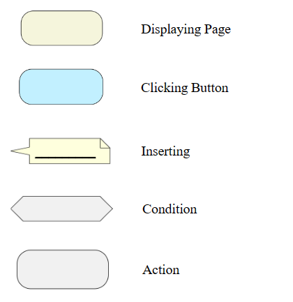
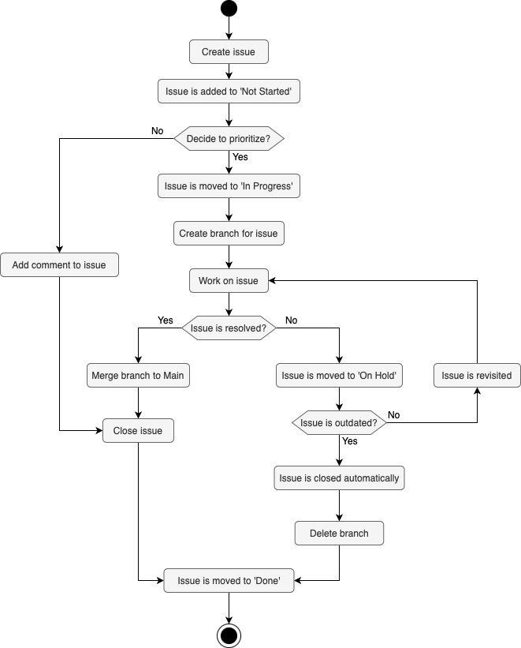
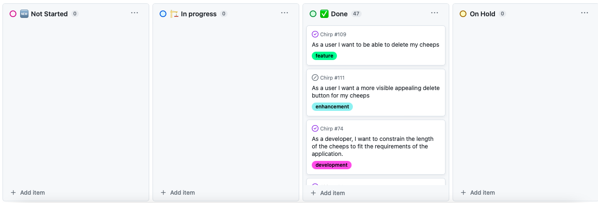

# Design and Architecture of _Chirp!_

## Domain model


Above is a UML class diagram of the domain model for our _Chirp!_ application. Here, you can see the fields the objects contain and how they associate with each other.

## Architecture — In the small

{width=500px}

Above is an illustration of the organization of our _Chirp!_ application. We use the architectural pattern 'Onion Architecture' to structure our code base. For each layer represented by a different nuance of gray, we illustrate the classes, interfaces, and packages that are part of the layer. The arrows illustrate the dependencies between the layers. For simplicity's sake, we have not illustrated the dependencies between the classes and interfaces within each layer. The illustration shows how dependencies flow inward and never outward, meaning that the inner layers have no knowledge of the outer layers. Our architecture consists of three layers, each represented by a different project in our code base. 

## Architecture of deployed application


Above is a deployment diagram that illustrates the architecture of our deployed _Chirp!_ application. It is a client-server application that is deployed to Azure, where the web app and the SQL database are hosted on different servers. Their means of communication are also illustrated. A legend is provided to the right of the diagram.

## User activities
Below are illustrations that show four different user journeys, which are common in the _Chirp!_ application. The first image is a legend which can be used to gain a better understanding of the following diagrams.

{width=200px}

Below is an activity diagram of an unauthorized user's journey logging in to the _Chirp!_ application. It shows the possibility to register with either GitHub or via the _Chirp!_ application's registration page.

{width=230px}

Below is an activity diagram of an unauthenticated user's journey logging in to the _Chirp!_ application. Here, it is also possible to log in with either GitHub or with an email as well as password.

{width=375px}

\newpage
Below is an activity diagram of an authenticated user's journey in the _Chirp!_ application, sending and deleting a cheep.

{width=275px}

\newpage
Below is an activity diagram of an unauthenticated user's journey using the _Chirp!_ application. '{Username}' should be interpreted as an arbitrary user who has posted a cheep in the _Chirp!_ application.

{width=150px}

\newpage
## Sequence of functionality/calls through _Chirp!_
{width=500px}

The illustration above shows a sequence diagram of calls through the _Chirp!_ application. There are four lifelines; 'Web Browser', 'Chirp.Web', 'chirpdb' and 'OAuth' in the diagram. The 'Web Browser' should be interpreted as the client, 'Chirp.Web' as the web application of the program, 'chirpdb' as the database and 'OAuth' as the web protocol that handles the user authentication. The diagram illustrates some of the communication that goes through the lifelines when using the _Chirp!_ application.

\newpage
# Process

## Build, test, release, and deployment
Below are three illustrations of our workflows that build, test, release and deploys the _Chirp!_ application. 

{width=240px}

The illustration above shows how the activities in our workflow 'build_and_test.yml' are activated after each other. This workflow runs on pushes and pull-requests to the main branch. This is done to make sure that none of our new changes or merges have destroyed our ability to build and test the program.

In the workflow, first our GitHub action version is checked out and chosen so that our workflow can access it. Next, dotnet is set up with version 7 before restoring our dependencies by running the command 'dotnet restore'. This command ensures that the packages that the _Chirp!_ application depends on, are downloaded and have no conflict between them. After this, the program is ready to get built. The command 'dotnet build --no-restore' is run which builds the project and its dependencies into a set of binaries. We use --no-restore since we just ran restore. The reason for splitting the processes up is to be able to locate the reason in case of errors. After the build, our tests are run with the command 'dotnet test test/Chirp.Infrastructure.Tests --no-build --verbosity normal' which will run our tests in the folder Chirp.Infrastructure.Tests. The reason for specifying the folder is to make sure that the Playwright tests are not run. The Playwright tests will fail due to the need for the application to run for them to succeed.

\newpage
{width=250px}

The above illustration shows how the release of our _Chirp!_ application is run in the workflow 'release_chirp.yml'. The workflow is activated when a push to the main branch with a tag happens. By using a tag when pushing to the main branch, we are able to mark a checkpoint in the project and give the commit a 'title'. These marks can be small or larger depending on the tag.

In the workflow, first a 'Checkout' and 'Setup dotnet', with version 7, command is run followed by 'Restore Dependencies'. After these commands, four builds are run sequentially. Windows, Linux, MacOS and MacOS Arm executables are build.

After the builds have finished, they get published. The executables are created and released as zip files that can be downloaded and run on your computer. The publishing includes all files that begin with 'cheep'. 

\newpage
{width=250px}

The illustration above shows the deployment of our _Chirp!_ application in the workflow 'main_bdsagroup1chirprazor.yml'. The workflow is activated through pushes to the main branch. This is to keep our web app updated whenever completed changes have been made, so it does not fall behind.

The workflow consists of two parts. A building process and a deployment process. The building process is important as it ensures that we do not deploy a program that does not work. In this process we first run the 'Checkout' and 'Setup dotnet', with version 7, commands. These are followed by the building command 'dotnet build src/Chirp.Web/ --configuration Release' and a publish. Lastly, we upload an artifact for the deployment job. When the building process is done, the deployment can start on the condition that the build was successful. This process downloads the artifact from the building job and then deploy to our Azure web app. 

## Team work

{width=400px}

The activity diagram above shows how we have been working with the requirements for the project. We have aimed to create issues weekly as the requirements were published. We usually tried to prioritize all the issues, so most were initially put to 'in progress'. Some of the issues that related to features that were just 'nice to have', we did not always get to, so they were moved to 'on hold' and either reviewed again or automatically closed. That way, our backlog did not get too cluttered, and we were able to navigate the most important issues.

\newpage
{width=600px}

Above is an image of the backlog of our issues after we stopped working on our project. As seen we do not have any undone issues. We either finished the task or it was moved to done due to it not being prioritized. Our workflow 'Close_inactive_issues.yml' will stale an issue after 30 days of it being inactive, and then lastly close the issues if it was inactive for additionally 14 days. All closed issues are moved to the 'Done' folder. 

\newpage
{width=500px}

To further track the progress on the project, we kept an informal logbook in Google Docs. This was merely done for our own sake. Above is a screenshot of some clipped-together content from the logbook. For each of our meetings, we wrote down what was done that day together with potential questions for our meetings with our TA. We also wrote down some agenda of the next meeting, so it would be easy to get started. The logbook enabled us to attain more structure to our process as we were able to keep track of additional information that did not fit on the project board. Furthermore, it eased the process of catching up on the project if one of the group members did not attend a meeting.

\newpage
## How to make _Chirp!_ work locally
In order to run the _Chirp!_ application locally, the repository from GitHub needs to be cloned, which can be done from the following address: <https://github.com/ITU-BDSA23-GROUP1/Chirp>.

Next, a container needs to be set up. This is done so that an SQL Server database can work locally. This can for example be done with the Docker platform. To install Docker, follow this guide: <https://docs.docker.com/engine/install/>.

To run a SQL Server database, the following command needs to be run:

```console
docker run -e "ACCEPT_EULA=Y" -e "MSSQL_SA_PASSWORD=<YourStrong!Passw0rd>" \
   -p 1433:1433 --name sql1 --hostname sql1 \
   -d \
   mcr.microsoft.com/mssql/server:2022-latest
``````

Here, you can replace <YourStrong!Passw0rd> with a password of your choice. The command will setup, configure and start up a database server.

To connect the program and the database server, an appsettings.json file should be made inside the 'Chirp.Web' folder. In this file, a connection string should be set up like so:

```code
{
"Chirp_ConnectionStrings": 
"Data Source=localhost,1433;Initial Catalog=Chirp;
User=sa;Password=<YourStrong!Passw0rd>;TrustServerCertificate=True"
}
``````
_Note that above three lines should be written as one single line in the appsettings file._

The name of the connection string should be "Chirp_ConnectionStrings", as this is the connection string we are referring to in Program.cs. The connection string should contain the same port and password as in the command you used to set up the database server.

Another necessary step is to set up a GitHub OAuth app. This can be done by following this guide: <https://docs.github.com/en/developers/apps/creating-an-oauth-app>. The homepage URL should be set to <http://localhost> The callback URL should be set to <http://localhost/signin-github>. The Client ID and Client Secret from your OAuth App should be added to the appsettings.json file above the database connection string like so:

```code
{
   "authentication_github_clientId": "<YOUR_CLIENTID>",
   "GITHUB_PROVIDER_AUTHENTICATION_SECRET": "<YOUR_CLIENTSECRET>",
   "Chirp_ConnectionStrings": "..."
}
``````

The app settings are now configured correctly for our application.
Now, open up Docker Desktop and start the database server.
After starting the database server, the program can be run. Start by opening a terminal in Chirp, and run the command:

```console
dotnet build
```

Run the program by navigating to the Chirp.Web folder in the terminal and running the command:

``` console
dotnet run
```


## How to run test suite locally
The first thing needed is downloading the VSCode extension called 'Playwright Test for VSCode'. After this has downloaded, the command ">Test: Install Playwright Browsers" should be entered into the search box at the top of VSCode. During the installation of the Playwright browsers, it will at some point prompt for overwriting the 'playwright.config.ts' file in the terminal. This should not be done, and therefore you should answer 'n' to this prompt. If the installation does not work you should follow this guide: <https://playwright.dev/docs/getting-started-vscode> and delete the files in the project that are autogenerated by the installation - all nessesary files should be in our code already and shouldn't be overwritten.

Before our test suite can be run locally, it firstly needs to run our program. This is the case as the Playwright tests need the program to be able to perform our UI tests. We do this by starting the docker container with the local database. Then we start up two terminals. One terminal is navigated to the folder _src/Chirp.Web_. In this terminal, run the command:

``` console
dotnet build
```

Followed by the command:

``` console
dotnet run
```

This should start up our program.

Afterwards, the other terminal should be navigated to our top folder, _Chirp_, and the following command should be run:

```
dotnet build
```

Followed by the command:

```
dotnet test
```

This should initialize all the tests being run and give back the test results in the terminal

In our test suite, we have unit tests, UI/E2E-tests and an integration test. We have not made full code coverage, and therefore only have unit tests for some of our methods. These methods are _GetByFilter_, _GetByFollowers_, _FindAuthorByName_, _CreateCheep_, _FollowAuthor_ and _DeleteCheep_.

Our integration test tests a few of our methods. These methods are _FindAuthorByName_, _FollowAuthor_, _CreateCheep_ and _GetByFollowers_.

The UI/E2E-tests that we have created test the overall functionality along with the UI elements and the navigation between the URLs.

# Ethics

## License
In our software, we decided to use the MIT license. This was our decision as the MIT license is a permissive software license. This means that our software can be freely used and distributed by others. However, we don't provide any sort of warranty in the event that anything breaks, and therefore are not liable for any damages or claims.

## LLMs, ChatGPT, CoPilot, and others
During the development of our project, we used ChatGPT and Copilot. We only used ChatGPT once in the beginning of our project when we were trying to create a process for running a bash script. We had prompted ChatGPT with our issue and asked for its help with generating some code. The given code was then fitted such that it fulfilled our needs. This code has since been deleted.

We used Copilot more frequently during our development. This was activated for most of our development, and therefore gave suggestions and helped autofill the code we were writing. Sometimes, we did also prompt Copilot where it gave us suggestions on how to fix our current prompt. Also, when having an error in our code, we sometimes asked it how to fix it. 

Often, when we were coding and Copilot gave suggestions, they were helpful and for the most parts completely correct. Occasionally, we needed to make some small fixes. When we prompted Copilot to do something specific, it did however not always go as well. The suggestions often went far from what we had intended or wanted. Especially, when we asked about errors in our code it did not help at all.

We do believe that using LLMs sped up our development. It made it much faster when coding, since it autocompleted lines or even entire methods for us. Prompting the LLMs with questions did not always provide the answers we needed, but it did however provide some insights to how the LLM thought it could be done and in which direction we did not want to go.
